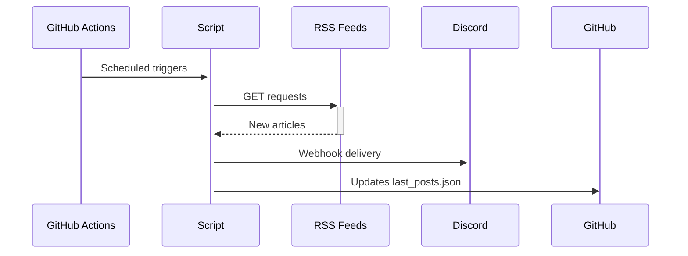

# rss-dreamteam

# RSS Discord webhook

An automated bot that monitors RSS feeds and pushes new articles to a Discord channel.

## Key Features

- __Multi-Feed Tracking__ : Simultaneously monitors multiple RSS feeds (`feeds.json`)
- __Duplicate Prevention__ : Remembers processed articles (`last_posts.json`)
- __Scheduled Updates__ : Checks feeds every 30 minutes via GitHub Actions
- __Clean Formatting__ : Clear Discord messages display 

## Quick Start

1. **Clone the repository**:

   ```bash
   git clone https://github.com/Gabryel666/rss-dreamteam.git
   cd rss-dreamteam
   ```

2. **Configure feeds**:
   Edit `feeds.json` to add your RSS sources:

   ```json
   {
     "Hugin & Munin": "https://example.com/feed.rss",
     "Le Grog": "https://www.legrog.org/rss"
   }
   ```

3. **Set up Discord**:

   - Create a webhook in your Discord channel settings

   - Add it to GitHub Secrets:

     ```
     Name: DISCORD_WEBHOOK
     Value: https://discord.com/api/webhooks/...
     ```

## Technical Overview



## File Structure

```
.
├── .github/
│   └── workflows/
│       └── rss-check.yml  # Automation config
├── feeds.json             # Feed list
├── last_posts.json        # Processed articles (auto-generated)
└── main.js                # Core script
```

## Customization

To change check frequency:

1. Edit `.github/workflows/rss-check.yml`

2. Modify the schedule:

   ```yaml
   - cron: '*/30 * * * *'  # Every 30 minutes
   ```

   Examples:  
   `'0 * * * *'` = Hourly  
   `'0 0 * * *'` = Daily

## 📄 License

MIT © [Gabryel666] - Free for use and modification
