# RSS-Discord-Bridge

<p align="center">
  <a href="https://github.com/Gabryel666/RSS-Discord-Bridge/releases" target="_blank">
    
  </a>
  <a href="https://github.com/Gabryel666/RSS-Discord-Bridge/blob/main/LICENSE" target="_blank">
    
  </a>
  <a href="https://discord.gg/CrfgXxhu95" target="_blank">
    
  </a>
</p>

An automated script that monitors RSS feeds and pushes new articles to Discord channels with multi-channel support.

You can check the release notes by clicking on [Release notes](https://github.com/Gabryel666/RSS-Discord-Bridge/blob/main/release%20notes.md)

## Key Features

- **Exhaustive History Retrieval**: Retrieves *all* missed articles between checks, not just the latest one.
- **Smart Desync Protection**: Prevents spam if a feed changes significantly or is new.
- **Multi-Channel Routing**: Send feeds to different Discord channels.
- **Multi-Feed Tracking**: Monitor unlimited RSS feeds (`feeds.json`).
- **Duplicate Prevention**: Persistent memory of processed articles (`last_posts.json`).
- **Scheduled Updates**: Configurable check frequency via GitHub Actions.
- **Clean Formatting**: Optimized Discord message display.

## Quick Start

1. **Clone the repository**:

   ```
   git clone https://github.com/Gabryel666/RSS-Discord-Bridge.git
   cd RSS-Discord-Bridge
   ```

2. **Configure feeds**:
    Edit `feeds.json` with channel routing (unique name required)

   ```
   {
     "Hugin & Munin": {
       "url": "https://example.com/feed.rss",
       "webhookKey": "news"
     },
     "Le Grog": {
       "url": "https://www.legrog.org/rss",
       "webhookKey": "gaming"
     }
   }
   ```

3. **Set up Discord webhooks**:

   - Create webhooks for each channel in Discord settings

   - Add them to GitHub Secrets as JSON:

     ```
     {
       "news": "https://discord.com/api/webhooks/...",
       "gaming": "https://discord.com/api/webhooks/..."
     }
     ```

   - Secret name: `DISCORD_WEBHOOKS`

## Technical Overview

```mermaid
sequenceDiagram
    participant GA as GitHub Actions
    participant Script
    participant RSS as RSS Feeds
    participant Discord

    GA->>Script: Déclenchement programmé
    Script->>RSS: Requête GET
    RSS-->>Script: Nouveaux articles
    Script->>Discord: Envoi ciblé
    Note right of Script: Route vers le bon salon
    Script->>GA: Mise à jour last_posts.json
```



## File Structure

```
.
├── .github/
│   └── workflows/
│       └── rss-check.yml    # Automation config
├── feeds.json               # Feed list with channel routing
├── last_posts.json          # Processed articles (auto-generated)
└── main.js                  # Core processing script
```

## Customization

### Change Check Frequency

Edit `.github/workflows/rss-check.yml`:

```
- cron: '*/30 * * * *'  # Every 30 minutes
```

### Available Intervals:

- `'*/15 * * * *'` - Every 15 minutes
- `'0 * * * *'` - Hourly
- `'0 0 * * *'` - Daily

## 📄 License

MIT © [Gabryel666] - Free for use and modification
